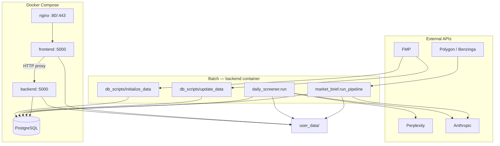

# Architecture

## Overview

Docker-compose stack: **Postgres** holds market data and pre-computed screener tables; **db_scripts** ingest from FMP and build derivative tables; **backend** (Flask) serves JSON APIs over those tables; **frontend** (Flask + Jinja) proxies to backend and renders pages. **nginx** terminates HTTP/HTTPS and forwards to frontend.

Two LLM pipelines run inside the **backend** container as Python modules (not separate services):

| Module | Purpose | Artifacts |
|--------|---------|-----------|
| `daily_screener/` | Momentum + news + judge shortlist | `user_data/daily_screener/<date>/` |
| `market_brief/` | Pre-market Benzinga brief | `user_data/market_brief/<date>/` |

## Runtime

| Service | Image / build | Host port | Role |
|---------|---------------|-----------|------|
| `db` | postgres:14 | 5432 | `stocks_db` |
| `backend` | `docker/backend.Dockerfile` | 5001→5000 | Flask API, batch scripts, LLM pipelines |
| `frontend` | `docker/frontend.Dockerfile` | 5002→5000 | Flask UI, thin proxy to backend |
| `nginx` | nginx:alpine | 80, 443 | Reverse proxy → frontend |

- Repo root is bind-mounted into `backend` (`/app`).
- `frontend` mounts `./frontend`, `./user_data`, `./logs`.
- Env: `.env` → `DATABASE_URL`, `FMP_API_KEY`, `POLYGON_API_KEY`, `PERPLEXITY_API_KEY`, `ANTHROPIC_API_KEY`, SMTP, `OLLAMA_BASE_URL`.
- Ops: `./manage-env.sh prod|dev` (start/stop/init/update/backup). Run scripts via `docker-compose exec backend …`, not on host.

## Data layer

### Ingest (`db_scripts/initialize_data/`)

One-time or reset loads from **FMP** into base tables: `tickers`, `ohlc`, `company_profiles`, `ratios_ttm`, `earnings`, `analyst_estimates`, index prices/constituents, `shares_float`.

### Daily update (`db_scripts/update_data/`)

Typical daily chain (order matters):

1. `daily_price_update.py` — OHLC
2. `daily_indices_update.py` — index prices
3. `stock_metrics_update.py` — `stock_metrics` (dr_1/5/20/60/120, atr20, rsi, ti65, PE/PS, rev/eps growth, …)
4. `ticker_moving_averages_update.py` — `ticker_moving_averages` (dma/ema)
5. `volspike_gapper_update.py` — `stock_volspike_gapper`
6. `main_view_update.py` — `main_view` (metrics + volspike/gapper + tags)
7. Optional: `market_breadth_update.py`, `rs_screener_update.py`

Benzinga cache: `create_benzinga_articles_table.py`, refreshed from backend/`benzinga_news.py` (Polygon).

### Key tables (derivative / query-facing)

| Table | Built by | Consumed by |
|-------|----------|-------------|
| `stock_metrics` | `stock_metrics_update` | Scanner endpoints, `daily_screener` s1 |
| `stock_volspike_gapper` | `volspike_gapper_update` | Vol/gap screens, `daily_screener` s1 |
| `main_view` | `main_view_update` | Main view / technical screener UI |
| `ticker_moving_averages` | `ticker_moving_averages_update` | Charts (dma/ema), market breadth |
| `rs_screener`, `market_breadth` | respective updates | RS / breadth views |
| `benzinga_articles` | Polygon ingest | Stock news, `market_brief` |

Schema + ORM: `backend/models.py`. Shared DB access pattern in `db_scripts/*` (SQLAlchemy, same `DATABASE_URL`).

## Backend API (`backend/app.py`)

Flask app on port 5000 inside container. Responsibilities:

- **Read** pre-computed rows with global filters (`apply_global_exclude_filters`, `apply_global_liquidity_filters`: avg_vol_10d, dollar_volume, price, industry exclusions).
- **Screener routes** — returns, gapper, volume, main view, technical criteria × market-cap bucket (Micro/Small/Mid/Large/Mega).
- **Stock detail** — profile, OHLC, earnings, Benzinga news refresh/cache.
- **User state** — `abi_watchlist`, `abi_dislikes`, general notes, comments (some persisted in DB, some in `user_data/` JSON).
- **Pipeline control** — spawn subprocesses for `daily_screener.run`, `market_brief.run_pipeline`; serve artifact JSON from `user_data/`.

Heavy computation belongs in **db_scripts**, not here. Backend adds HTTP filtering, formatting, and CRUD for user artifacts.

## Frontend (`frontend/app.py`)

Flask + Jinja templates under `frontend/templates/`, static under `frontend/static/`.

- Pages call `make_backend_request()` → `BACKEND_URL` (`http://backend:5000`).
- `/api/frontend/*` routes are BFF-style proxies (themes, watchlist, daily shortlist, market brief, screeners).
- **No business logic** for screening metrics; renders tables/charts from backend JSON.

Notable pages: `/main-view`, `/top-performance`, `/volspike-gapper`, `/rs-screener`, `/stock/<ticker>`, `/abi-watchlist`, `/daily-shortlist`, `/daily-themes`, `/market-brief`, `/themes`.

## LLM pipelines

### Daily screener (`daily_screener/`)

Stages (JSON in/out under `user_data/daily_screener/<YYYY-MM-DD>/`):

1. **Universe** — DB: top dr_1/5/20 + volspike_gapper; veto active `abi_dislikes.json` (skip expired temps)
2. **Momentum** — rule score (multi_screen, dr5_atr_norm, trend_alignment, …); threshold in `config.py`
3. **Themes** — merge `themes.json`, watchlist-derived themes (Claude), hot-market (Perplexity)
4. **News** — Perplexity per ticker
5. **Judge** — LLM verdict PICK/WATCH/SKIP + feedback from `daily_screener_feedback.json`
6. **Audit** — `05_audit.json` (SoT for UI)

See `daily_screener/README.md` for flags and QA loop.

### Market brief (`market_brief/`)

1. **Fetch** — Polygon/Benzinga → `source/` + `benzinga_articles`
2. **Summarize** — Anthropic Sonnet → `01_summaries/`
3. **Synthesize** — Anthropic Opus → `02_brief.md`

Ticker universe from DB screens (`screener_universe.py`: r1d, vol_spike_5d, main_view_ti65). See `market_brief/README.md`.

## `user_data/` (git-backed via `auto_commit.sh`)

| Path | Contents |
|------|----------|
| `themes.json` | Curated theme tags |
| `abi_watchlist.json` | Stars, notes |
| `abi_dislikes.json` | Global ticker exclude: `kind=permanent` or `kind=temporary` (`expires_at` = +30d). Applied to all screener queries + daily_screener s1. |
| `abi_passes.json` | Weekly-review pass: `{cycle: Sat-ET-iso}`. Hidden on `/weekly-review` until next Saturday. |
| `abi_trades.json` | Buy/short candidates. Hidden on `/weekly-review` while listed. |
| `daily_screener/<date>/` | Pipeline stage JSON |
| `daily_screener_feedback.json` | Judge calibration |
| `market_brief/<date>/` | Brief artifacts, `run_costs.json` |

Frontend and backend both read these paths; keep `OUTPUTS_DIR` constants in sync (`daily_screener/config.py`, `market_brief/config.py`, `backend/app.py`).

## Where logic lives

| Layer | Owns |
|-------|------|
| **db_scripts** | Ingest, metric computation, table rebuilds, tags on `main_view` |
| **backend** | HTTP API, global query filters, user CRUD, subprocess orchestration, Benzinga refresh |
| **daily_screener / market_brief** | Multi-step LLM workflows, file artifacts |
| **frontend** | Routing, proxy, rendering |

**Default:** new screening fields or filters → compute in `db_scripts`, expose via backend route, render in frontend. Backend-only logic is acceptable for API-specific shaping; frontend logic only for presentation.

## Other paths

| Path | Notes |
|------|-------|
| `screening_agent/` | Legacy experiment; not used by production UI |
| `weekly_brief/` | Empty placeholder |
| `tests/` | pytest |
| `archive/` | Old compose variants |

## Related docs

- `README/README.md` — init/update command cheatsheets
- `README/ENDPOINTS.md` — API URL list
- `daily_screener/README.md`, `market_brief/README.md` — pipeline detail
